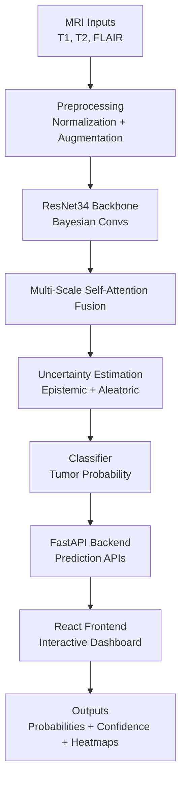

# 🧠 NeuroVision AI

**Multi-Scale Self-Attention MRI Fusion for Brain Tumor Detection**
*Towards Trustworthy AI for Clinical Diagnosis*


---

## 📜 Overview

**NeuroVision AI** is a full-stack AI system for **brain tumor detection** from MRI scans.

It combines:

* **Backend (FastAPI + PyTorch)** → AI inference, uncertainty quantification, explainability (Grad-CAM++)
* **Frontend (React + Tailwind + Vite)** → Interactive dashboard for clinicians to upload scans, view predictions, uncertainty, and explanations

Unlike existing CNN-only solutions, NeuroVision AI integrates:

* **Multi-Scale Self-Attention** for feature fusion
* **Bayesian Convolutions** for uncertainty-aware predictions
* **Grad-CAM++** for clinician trust

**Key domains:**

* 🏥 Medical Imaging
* 🧠 Brain Tumor Detection
* 🔬 Explainable AI in Healthcare
* ✅ Clinical Decision Support

---

## ⚙️ Features

* 📥 Multi-modal MRI ingestion (T1, T2, FLAIR)
* ✂️ Preprocessing + Augmentation for robustness
* 🔍 Multi-Scale Self-Attention Fusion
* 🤖 Bayesian CNNs with Monte Carlo Dropout
* 🧠 Uncertainty quantification (epistemic + aleatoric)
* 🔎 Explainability via Grad-CAM++
* 💻 Full-stack deployment (FastAPI backend + React frontend)

---

## 🏗 Architecture



---

## 🖥 Tech Stack

* **Backend**: Python 3.10, FastAPI, PyTorch, ONNX Runtime, PostgreSQL (for history)
* **Frontend**: React, TypeScript, Vite, TailwindCSS
* **Model Backbone**: ResNet34 + Bayesian Convs + Multi-Scale Attention
* **Loss & Optimization**: Focal Loss + KL Div, AdamW, Cosine Annealing
* **Explainability**: Grad-CAM++

---

## 📂 Project Structure

```
.
├── backend/
│   ├── main.py           # FastAPI entrypoint
│   ├── routes/           # API routes (auth, predict, history)
│   ├── models/           # Pretrained tumor detection models (ONNX, pkl)
│   ├── services/         # Database & business logic
│   ├── database.py       # DB config
│   ├── schemas.py        # Pydantic schemas
│   ├── requirements.txt  # Backend dependencies
│
├── frontend/
│   ├── index.html        # Entry point
│   ├── src/              # React + TS components
│   ├── tailwind.config.ts
│   ├── vite.config.ts
│   ├── package.json      # Frontend dependencies
│
├── notebooks/            # Jupyter notebooks (preprocessing → evaluation)
├── results/              # Checkpoints, metrics, visualizations
├── LICENSE
└── README.md
```

---

## 🚀 Quick Start

### 🔹 1. Clone Repository

```bash
git clone https://github.com/0-SURYA-0/NueroVision-AI.git
cd NueroVision-AI
```

### 🔹 2. Backend Setup

```bash
cd backend
python -m venv venv
source venv/bin/activate   # Linux/Mac
venv\Scripts\activate      # Windows

pip install -r requirements.txt

# Run FastAPI server
uvicorn main:app --reload --port 8000
```

### 🔹 3. Frontend Setup

```bash
cd frontend
npm install
npm run dev   # Runs React app at http://localhost:5173
```

### 🔹 4. Usage

* Open frontend in browser → Upload MRI scan → Backend processes → Dashboard shows:

  * ✅ Tumor probability
  * 📊 Epistemic & Aleatoric uncertainty
  * 🔎 Grad-CAM++ heatmap

---

## 📈 Results

* **High ROC-AUC** on multi-modal MRI datasets
* **Confidence-aware predictions** for safe clinical adoption
* **Explainability** with Grad-CAM++ heatmaps
---

## 🔮 Future Enhancements

* Multi-class tumor classification (glioma, meningioma, pituitary)
* Integration with **MONAI** for medical imaging
* Deployment with Docker + Kubernetes
* Secure clinician dashboard with authentication

---

## 📜 License

This project is licensed under the **MIT License** – see [LICENSE](LICENSE).

---

## 🤝 Contributing

1. Fork the repository
2. Create a new branch (`feature/xyz`)
3. Commit changes (`git commit -m 'Add xyz feature'`)
4. Push (`git push origin feature/xyz`)
5. Open a Pull Request
